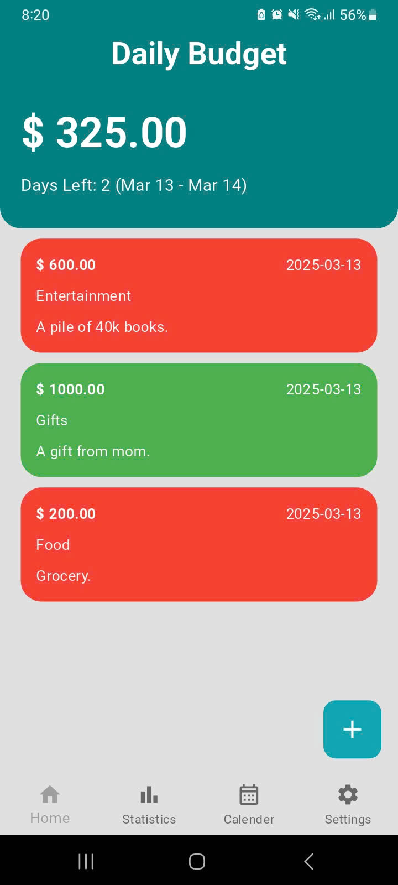
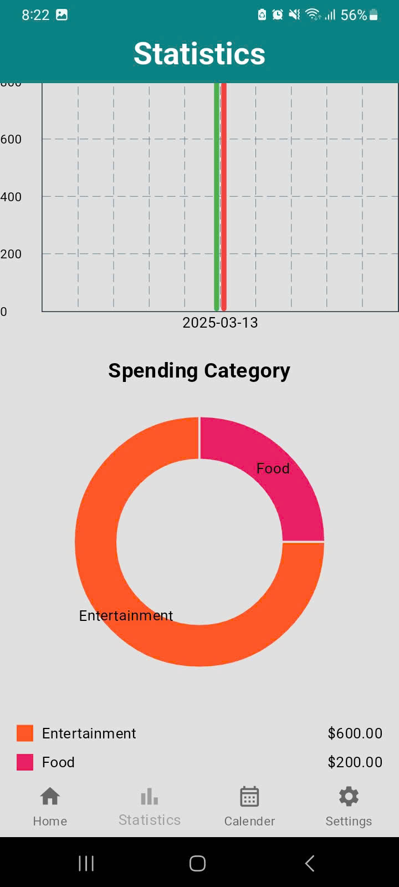
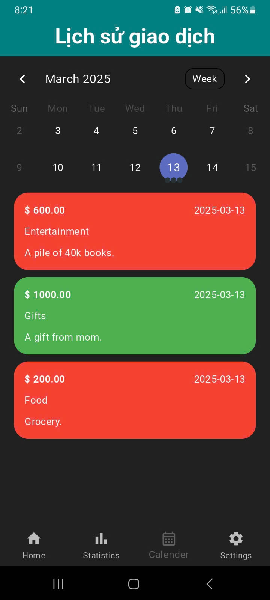
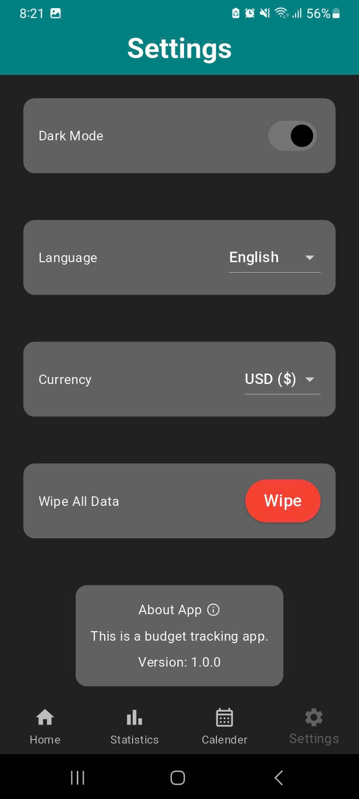

# BudgetBuddy

    
    

A simple budget tracking app built with Flutter to help users manage their finances effectively.

## Preview

|  |  |  |  |
|------------------------------------------|-----------------------------------------------------|-------------------------------------------|------------------------------------------|

## Tech Stack & Libraries

- [Flutter](https://flutter.dev/) - Cross-platform framework for building natively compiled applications.
- [Dart](https://dart.dev/) - Programming language used by Flutter.
- [SQFLite](https://pub.dev/packages/sqflite) - SQLite plugin for Flutter to handle local database storage.
- [Provider](https://pub.dev/packages/provider) - State management solution for Flutter apps.
- [FL Chart](https://pub.dev/packages/fl_chart) - Library for creating beautiful charts (pie charts, bar charts, etc.).
- [Flutter Localization](https://pub.dev/packages/flutter_localization) - For supporting multiple languages in the app.
- [Shared Preferences](https://pub.dev/packages/shared_preferences) - For storing simple key-value pairs like theme preferences.
- [Table Calendar](https://pub.dev/packages/table_calendar) - Customizable calendar widget for date selection.
- [Flutter Slidable](https://pub.dev/packages/flutter_slidable) - For creating swipe-able list items with actions.
- [Animated Flip Counter](https://pub.dev/packages/animated_flip_counter) - For animated counter animations.
- [Path](https://pub.dev/packages/path) & [Path Provider](https://pub.dev/packages/path_provider) - For handling file paths and storage.
- [Intl](https://pub.dev/packages/intl) - For internationalization and formatting (e.g., currency, dates).
- [Logger](https://pub.dev/packages/logger) - For logging and debugging.
- [Flutter Launcher Icons](https://pub.dev/packages/flutter_launcher_icons) - For generating app launcher icons.

## Features

- **Navigation:**
    - Bottom navigation bar: Provides quick and easy access to the app's primary sections.
    - Screen Navigation: Seamlessly navigate between the splash screen, home screen, calendar, statistics, new transaction, and settings screens.
- **Transaction Handling:**
    - Budget Setup: Quickly define a new budget via an interactive dialog, allowing date selection.
    - Transaction Creation: Easily create new transactions using a dedicated transaction input screen.
    - Transaction Management: View, edit, and manage transactions using swipe-able actions for quick modifications.
    - Animated Transaction Counters: Visually appealing animated counters display transaction amounts.
- **Statistics and Insights:**
    - Spending Visualization: Analyze spending patterns and trends through various interactive charts.
    - Categorical Spending Breakdown: Visualize spending amounts by category using clear and informative pie charts.
    - Calendar View: Utilize an integrated calendar to review transactions by date.
- **Settings and Customization:**
    - Theme Switching: Switch between light and dark themes to suit your preferences.
    - Localization Support: Multiple language support through app localization.
    - Currency Selection: Select your preferred currency for localized financial tracking.
    - Budget Reset: Wipe old budget data for a fresh start.
- **Database and Persistence:**
    - Local Data Storage: Store transactions and budget data locally using SQFLite.
    - User Preference Persistence: User preferences, such as theme and language settings, are stored and retained between sessions.
